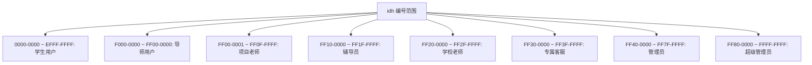
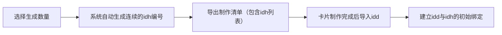
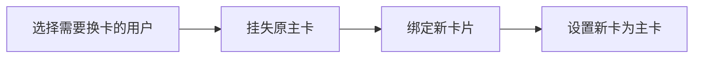

# 笨猫丫丫OPC学习陪跑系统·产品执行手册 V2.4

| 项目 | 内容 |
| :--- | :--- |
| **产品名称** | 笨猫丫丫OPC学习陪跑系统 |
| **产品定位** | 学业规划，一触即达。迷茫时碰一下，规划路上不孤单。 |
| **核心载体** | NFC实体卡片 + Web/App端管理系统 |
| **目标用户** | 大一新生、本科生、家长（亲情监督）、导师、管理者 |
| **版本号** | V2.4 |
| **更新日期** | 2026-06-12 |

---

## 核心交互流程：“入学三部曲” (User Journey)

### 第一幕：初见·开启旅程（首次激活）

- **场景**：新生拿到录取通知书后，首次触碰NFC卡片
- **卡片状态**：`1-新卡（未注册）` → `2-已注册未分配导师`
- **前端交互**：
  - **动效**：全屏Loading动画，“正在为你生成专属攻略...”
  - **文案**：“欢迎开启你的大学旅程”，“学业规划，一触即达”
- **用户操作**：
  1. **基础录入**：姓名、电话、邮箱、大学、学院（二级学院）、专业
  2. **目标锚定（多选）**：保研/推免、考研深造、大满贯毕业、高质量就业、出国留学、考公考编、其他自定义
  3. **学院选择**：下拉选择所属学院
- **后台逻辑**：
  - 保存用户数据，将卡片UID与用户ID绑定
  - AI初步解析用户目标，生成V0.1版规划草案
  - 标记卡片状态为`2-已注册未分配导师`
- **容错设计**：网络延迟时允许先填表，后台异步生成攻略

### 第二幕：连接·导师就位（信任建立）

#### 阶段A：等待匹配

- **触发**：学生提交资料后再次碰卡
- **卡片状态**：`2-已注册未分配导师`
- **界面**：显示“正在为你匹配专属导师...”或“导师正在赶来的路上”
- **容错设计**：导师未及时响应时显示安抚性提示，避免用户焦虑

#### 阶段B：导师揭晓（第二次有效碰卡）

- **触发**：后台管理员完成分配后，学生再次碰卡
- **卡片状态**：`3-已分配导师`
- **通知**：系统自动发送短信/邮件：“【笨猫丫丫】你的专属指导老师已就位！请再次触碰NFC卡片查看。”
- **界面交互（拆信特效）**：
  - **视觉**：模拟拆开信封，展示导师名片（头像、清北博士标签、金牌教练标签）
  - **数据背书**：展示辅导次数、好评率（99%）、获奖学员数
  - **行动点（沟通矩阵）**：
    - **[发送邮件]**：点击唤起邮件客户端，预填导师邮箱及默认问候模板
    - **[添加企业微信]**：展示导师企微二维码或一键复制微信号
    - **[加入腾讯会议]**：直接展示腾讯会议号及密码，并提供一键复制功能
- **业务动作**：
  - 双方通过上述渠道沟通
  - **关键产出**：共同确认一份可行的 **SOP V1.0版四年路线图**
  - **签署协议**：确认合作模式（对赌分成 OR 年费订阅）

### 第三幕：启程·日常陪跑（高频使用）

- **触发**：SOP确认后，学生进入日常学习状态，随时碰卡
- **卡片状态**：`4-活跃用户（SOP已确认）`
- **界面反馈**：直接跳转至 **【个人专属仪表盘】**
- **核心模块**：
  1. **SOP通关地图（可视化增强）**：时间轴上方展示路线图缩略图，配文“李明博士已为你准备了初步草案”
  2. **本周任务清单（紧迫感设计）**：临近截止日期的任务增加橙色倒计时标签或进度条
  3. **奖金账户（分润金融化）**：实时显示累计奖金，点击弹出“资产详情页”，提供 **[确认分润/去支付]** 按钮
  4. **荣誉徽章**：连续打卡30天、竞赛获奖等成就解锁

---

## 核心创新：亲情共育与多卡绑定机制

### 1. 业务场景定义

| 卡片类型 | 使用场景 | 说明 |
| :--- | :--- | :--- |
| 学生自用卡 | 钥匙扣、名片卡、随身物理卡 | 日常高频碰一碰打卡与查看需求 |
| 父母亲情卡 | 由学生或平台邮寄给父母 | 父母通过手机碰卡进入“家长专属观察室” |

### 2. 家长专属观察室（家长端碰卡反馈）

- **界面反馈**：展示“您的孩子 [姓名] 正在笨猫丫丫系统内成长”
- **核心展示内容（只读权限）**：
  - **SOP执行状态**：当前学期进度、本周任务完成率
  - **近期荣誉与获奖**：最新获得的奖学金、竞赛奖项、证书
  - **成长轨迹**：连续打卡天数、导师评价摘要
- **互动设计**：提供 **[发送鼓励]** 按钮，点击后可向学生的App端推送一条匿名或署名的鼓励弹幕/消息

---

## 底层架构：NFC卡片与身份标识机制

### 1. 双ID绑定机制

| 项目 | 说明 |
| :--- | :--- |
| **idd** | NFC卡的独立物理ID，每张卡唯一，用于硬件识别 |
| **idh** | 8位16进制编号，用于区分用户类型及权限范围 |

### 2. idh 编号规则与角色映射



### 3. 卡片状态与页面路由映射

| 状态码 | 状态描述 | 展示页面 |
| :--- | :--- | :--- |
| 1 | 新卡（未注册） | 注册页 |
| 2 | 已注册未分配导师 | 等待页 |
| 3 | 已分配导师 | 导师匹配成功页 |
| 4 | 活跃用户（SOP已确认） | 个人仪表盘 |
| 5 | 挂失 | 挂失提示页 |
| 6 | 导师用户 | 导师专属仪表盘 |
| 7 | 系统展示页 | 系统介绍页 |
| 8 | 系统管理 | 系统管理页 |

---

## 角色权限体系 (RBAC)

| 角色 | 权限范围 | 核心功能 |
| :--- | :--- | :--- |
| **超级管理员** | 系统全部权限 | 所有管理功能、数据查看、系统配置 |
| **管理员** | 大部分管理权限 | 用户管理、卡片管理、数据统计 |
| **辅导员** | 所负责学生管理 | 查看学生状态、发送消息、预约管理 |
| **学校老师** | 任课学生管理 | 查看学生成绩、发送通知 |
| **专属客服** | 负责学生服务 | 处理学生问题、发送消息 |
| **项目老师** | 特定项目管理 | 项目学生管理、进度监控 |
| **导师用户** | 所指导学生管理 | 学生进度监控、SOP确认、预约管理 |
| **学生用户** | 个人信息管理 | 查看个人数据、打卡、预约、分润支付 |
| **家长（亲情卡）** | 关联学生只读权限 | 查看学生SOP进度、获奖状态、发送鼓励消息 |

---

## 后台管理系统：NFC卡片生命周期管理（核心模块）

### 1. 绑定时机与管理机制

- **绑定时机**：生成NFC卡片时，后台系统进行初始绑定
- **绑定方式**：后台管理系统单独页面维护，支持通过手机号、邮箱、名字、idh等进行灵活绑定
- **多卡绑定支持**：允许同一个学生账号绑定多个idd（如：钥匙扣卡、父母亲情卡）
- **管理功能**：支持删除、新增、编辑绑定关系，为后期换卡预留方案

### 2. 页面功能矩阵

| 功能 | 描述 |
| :--- | :--- |
| **卡片列表** | 展示所有NFC卡片，支持按idd、idh、用户、状态筛选 |
| **新卡制作** | 批量生成idh编号，导出制作清单 |
| **发卡绑定** | 将制作好的卡片（idd）与学生信息进行绑定（支持标记为“父母亲情卡”） |
| **解绑操作** | 解除卡片与用户的绑定关系 |
| **挂失/解挂** | 对丢失的卡片进行挂失，找回后可解挂 |
| **换卡处理** | 支持挂失旧卡并绑定新卡的一键换卡流程 |
| **主副卡设置** | 为用户设置主卡和副卡（如：学生卡为主，父母卡为副） |

### 3. 卡片状态流转逻辑

```text
未绑定 ──► 绑定用户 ──► 正常使用
    │           │
    │           ▼
    │        挂失 ──► 解挂
    │           │
    ▼           ▼
   作废       换卡
```

### 4. 核心操作流程SOP

#### 流程一：新卡制作



#### 流程二：发卡绑定

```mermaid
flowchart LR
    A[输入/扫描idd] --> B[查询卡片信息]
    B --> C[通过手机号/邮箱/idh搜索用户]
    C --> D[确认绑定关系（可选：标记为亲情卡）]
    D --> E[更新卡片状态为"已绑定"]
```

#### 流程三：换卡处理



---

## 商业模式引擎：奖金与分润

### 模式对比

| 模式 | 描述 | 结算规则 | 适用人群 |
| :--- | :--- | :--- | :--- |
| **模式一：对赌分成** | 前期0费用，以结果为导向 | 默认50%归学生，50%归导师/平台。T+3结算 | 家庭预算有限但对自己有信心的学生 |
| **模式二：年费订阅** | 付费购买服务，奖励全归学生 | 默认7999元/学年。获奖奖金100%归学生 | 家庭预算充足，希望独占奖励的学生 |

### 关键规则

- **切换机制**：仅在SOP周期变更（如大一升大二）时允许重新选择模式
- **资金流向逻辑**：学生获得竞赛奖金后，需将约定比例分给平台。系统提供正规支付收银台，支付成功后自动更新流水状态为“已结算”

---

## 体验优化总结 (UX/UI Notes)

| 优化方向 | 具体措施 | 目标效果 |
| :--- | :--- | :--- |
| **沟通矩阵化** | 保留邮件、新增企微、腾讯会议号展示及一键复制 | 满足不同场景下的沟通需求 |
| **规划可视化** | 缩略图+“草案已备好”文案 | 消除学生对“规划是否落地”的疑虑 |
| **执行紧迫化** | 倒计时标签、进度条 | 对抗拖延症，促动执行 |
| **分润金融化** | “资产详情页”+“支付收银台”交互 | 让分润行为正规、透明、有仪式感 |
| **亲情仪式化** | 父母亲情卡+“家长专属观察室” | 将数据转化为家庭动力，增强口碑传播 |
| **系统容错性** | 异步加载、情绪安抚机制 | 提升弱网环境和延迟场景下的用户体验 |

---

## 版本更新日志

| 版本 | 更新内容 | 更新日期 |
| :--- | :--- | :--- |
| **V2.1** | 初始版本，定义核心交互流程 | 2026-06-01 |
| **V2.2** | 新增亲情卡机制、家长观察室功能 | 2026-06-05 |
| **V2.3** | 完善角色权限体系、后台管理模块 | 2026-06-10 |
| **V2.4** | 格式规范化、添加Mermaid图表、优化结构 | 2026-06-12 |

---

**文档状态**：✅ 正式版  
**审核状态**：✅ 已审核  
**生效日期**：2026-06-12

---

*笨猫丫丫OPC · 外表笨笨，内核聪明*
